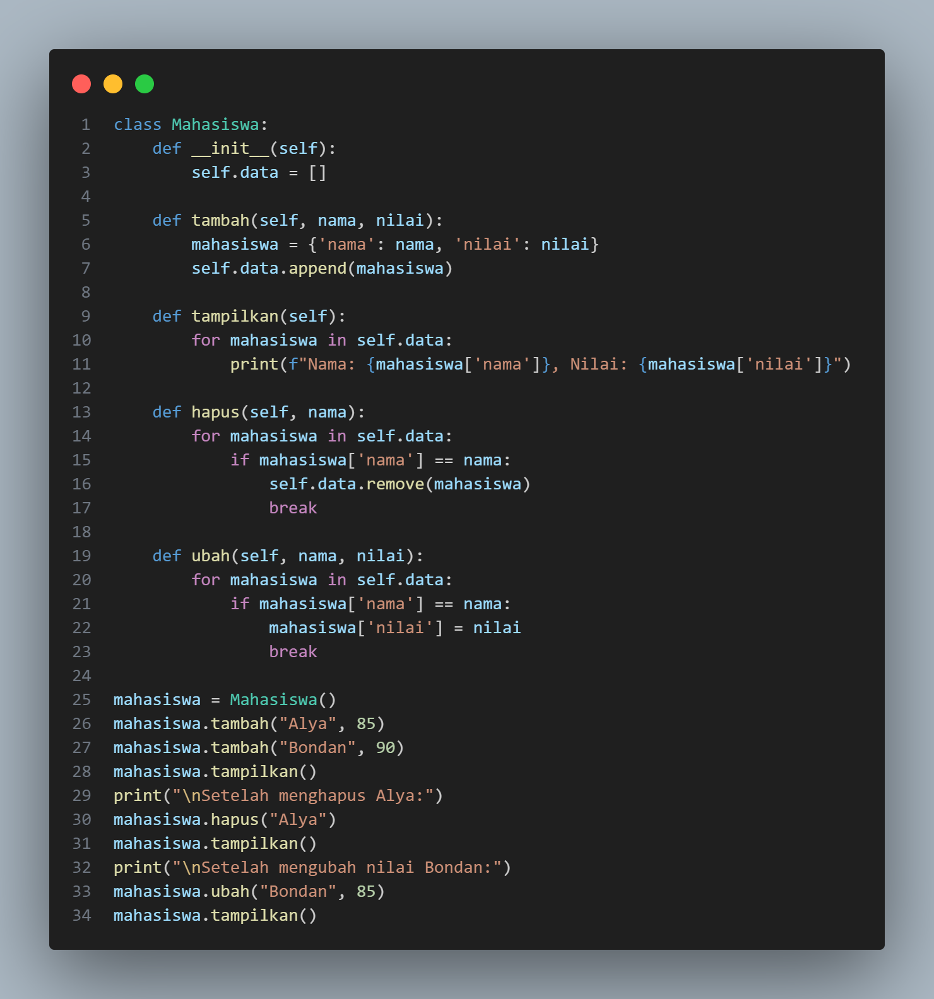
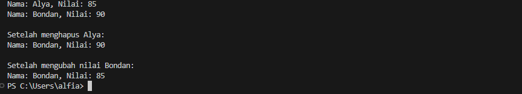
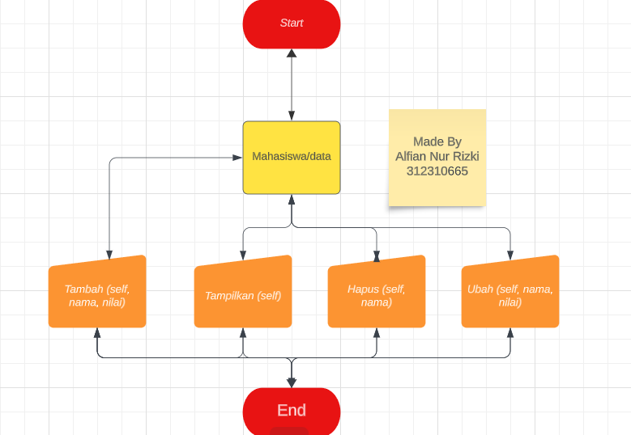

# Praktikum8

<h1>Tugas Praktikum</h1>

Buat program sederhana dengan mengaplikasikan penggunaan fungsi
yang akan menampilkan daftar nilai mahasiswa, dengan ketentuan:

• Fungsi tambah() untuk menambah data

• Fungsi tampilkan() untuk menampilkan data

• Fungsi hapus(nama) untuk menghapus data berdasarkan nama

• Fungsi ubah(nama) untuk mengubah data berdasarkan nama

Tampilan Program Tugas Praktikum

Tampilan Output Program Tugas Praktikum

Tampilan Flowchart Tugas Praktikum

